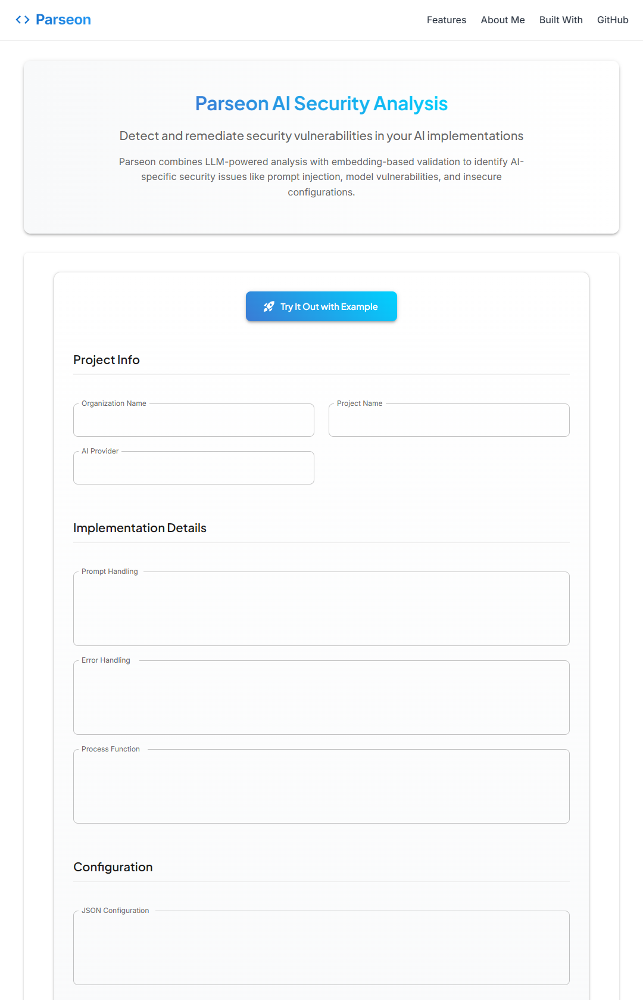

# Parseon - AI Security Assessment Tool

Parseon is a solo-built AI security assessment tool designed to detect and explain security vulnerabilities in AI-integrated applications. I built this project to demonstrate practical AI security analysis using large language models (LLMs) and embedding-based validation.


## Features

- **Dynamic AI Security Analysis**: Analyzes AI code, prompts, and model configurations for security issues
- **AI-Specific Security Patterns**: Detects prompt injection, unsafe model settings, insecure API usage, and more
- **Automated Validation**: Checks findings against a database of known vulnerabilities using embedding similarity
- **Security Scoring**: Assigns a risk-based score and highlights high-priority actions

## Assessment Form

The assessment form provides an intuitive interface for submitting AI implementations for security analysis. You can quickly try out the tool with example data or submit your own code and configurations.



## Results

After analysis, Parseon provides a comprehensive security assessment report with:

- Overall security score
- Category-specific scores
- Detailed vulnerability findings
- Recommendation severity ratings
- Prioritized action items


## How It Works

- The backend (FastAPI, Python) uses LLMs to scan submitted code and configs for patterns matching known AI security risks.
- Each finding is compared to a database of real-world vulnerabilities using vector embeddings to reduce false positives.
- The frontend (Next.js, React, Material UI) provides a modern UI for submitting assessments and viewing results.

## Deployment

### Frontend (Vercel)

```bash
cd frontend
npm install
npm run build
```

### Backend (Railway)

```bash
cd backend
pip install -r requirements.txt
python main.py
```

Railway configuration is provided in `railway.toml`.

## Environment Setup

- Project runs in WSL (Windows Subsystem for Linux)
- Python environment: Use `python3` command instead of `python`
- Virtual Environment: Activate with `source ~/projects/parseon_env/bin/activate`
- Dependencies: All required packages listed in backend/requirements.txt

## Common Commands

- Activate environment: `source ~/projects/parseon_env/bin/activate`
- Run tests: `python3 -m pytest tests/`
- Install dependencies: `pip3 install -r backend/requirements.txt`

Note: Always activate the parseon environment with `source ~/projects/parseon_env/bin/activate` before running any commands.

## About Me

I'm a cybersecurity professional pivoting into AI security, with a focus on identifying and addressing vulnerabilities specific to AI implementations. I'm passionate about building secure AI systems that organizations can deploy with confidence.

My experience with large language models, RAG architecture, and security frameworks gives me a unique perspective on AI security challenges. Parseon represents my approach to systematically assessing and validating AI security posture across different implementation patterns.

## Technical Stack

- **Frontend**: Next.js, React, TypeScript, Material UI
- **Backend**: Python, FastAPI, SQLAlchemy
- **AI Components**: OpenAI API, Embeddings, Vector Similarity
- **Database**: PostgreSQL
- **Deployment**: Vercel (frontend), Railway (backend)

## License

This project is for portfolio demonstration purposes only. 